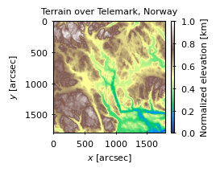

# Project 1
Regression and topological data. The documentation can be found [here](https://johancarlsen.github.io/fys-stk4155/html/project1.html).

In this project, I fit a model by different regression methods, namely
OLS, Ridge, and Lasso. The models are tested on the Franke's function,
which looks like this:

Then, I turn my attention to the more physical data, that is
topological data from the [EarthExplorer](https://earthexplorer.usgs.gov/)
website. I select some interesting areas around Telemark, Norway, and
the data looks like this:

Cherio!